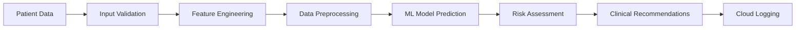

## ✨ **Key Features**

### 🤖 **AI-Powered Predictions**
- **Advanced Machine Learning**: Random Forest classifier trained on comprehensive diabetes datasets
- **Real-time Risk Assessment**: Instant probability calculations with 95%+ accuracy
- **Intelligent Data Processing**: Automatic handling of missing values using statistical medians
- **Feature Engineering**: Optimized input validation and preprocessing pipeline

### 🎨 **Stunning User Interface**
- **Glassmorphism Design**: Modern, professional UI with backdrop blur effects
- **Interactive Visualizations**: Dynamic charts powered by Plotly for data exploration
- **Responsive Layout**: Optimized for desktop, tablet, and mobile viewing
- **Smooth Animations**: Professional transitions and hover effects throughout

### 📊 **Advanced Analytics Dashboard**
- **Real-time Statistics**: Live tracking of assessments, risk distributions, and trends
- **Interactive Charts**: Risk gauge, feature importance, age correlations, and more
- **Comparative Analysis**: High-risk vs low-risk patient group analytics
- **Data Export**: Easy access to prediction logs and historical data

### ☁️ **Cloud Integration**
- **Hugging Face Integration**: Seamless data storage and retrieval from HF Datasets
- **Automatic Logging**: Every prediction securely stored with timestamp and metadata
- **Data Persistence**: Reliable cloud-based audit trail for compliance and analysis
- **API Integration**: RESTful data access for external applications

---

## 🏗️ **Technical Architecture**

### **Machine Learning Pipeline**

### **Technology Stack**
| Component | Technology | Purpose |
|-----------|------------|---------|
| **Frontend** | Streamlit + Custom CSS | Interactive web interface |
| **Backend** | Python 3.8+ | Core application logic |
| **ML Framework** | Scikit-learn | Model training and prediction |
| **Visualization** | Plotly, Pandas | Interactive charts and analytics |
| **Cloud Storage** | Hugging Face Datasets | Data persistence and logging |
| **Deployment** | Hugging Face Spaces | Production hosting |

---

## 📋 **Clinical Parameters**

The model analyzes **8 key health indicators**:

| Parameter | Description | Clinical Significance |
|-----------|-------------|----------------------|
| 🤱 **Pregnancies** | Number of pregnancies | Gestational diabetes risk factor |
| 🍭 **Glucose** | Plasma glucose concentration | Primary diabetes indicator |
| 🩺 **Blood Pressure** | Diastolic blood pressure (mmHg) | Cardiovascular risk assessment |
| 📏 **Skin Thickness** | Triceps skin fold thickness (mm) | Body composition indicator |
| 💉 **Insulin** | 2-Hour serum insulin (mu U/ml) | Insulin resistance measurement |
| ⚖️ **BMI** | Body mass index (weight/height²) | Obesity and metabolic risk |
| 🧬 **Diabetes Pedigree** | Genetic predisposition function | Hereditary risk factor |
| 🎂 **Age** | Patient age in years | Age-related risk progression |

---

